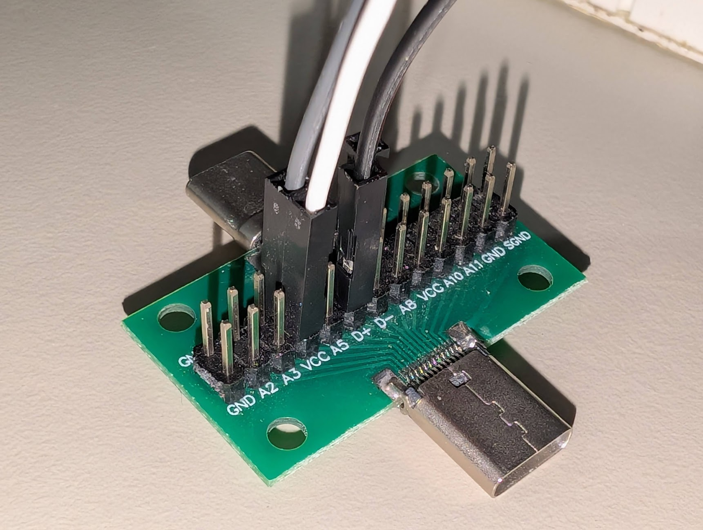
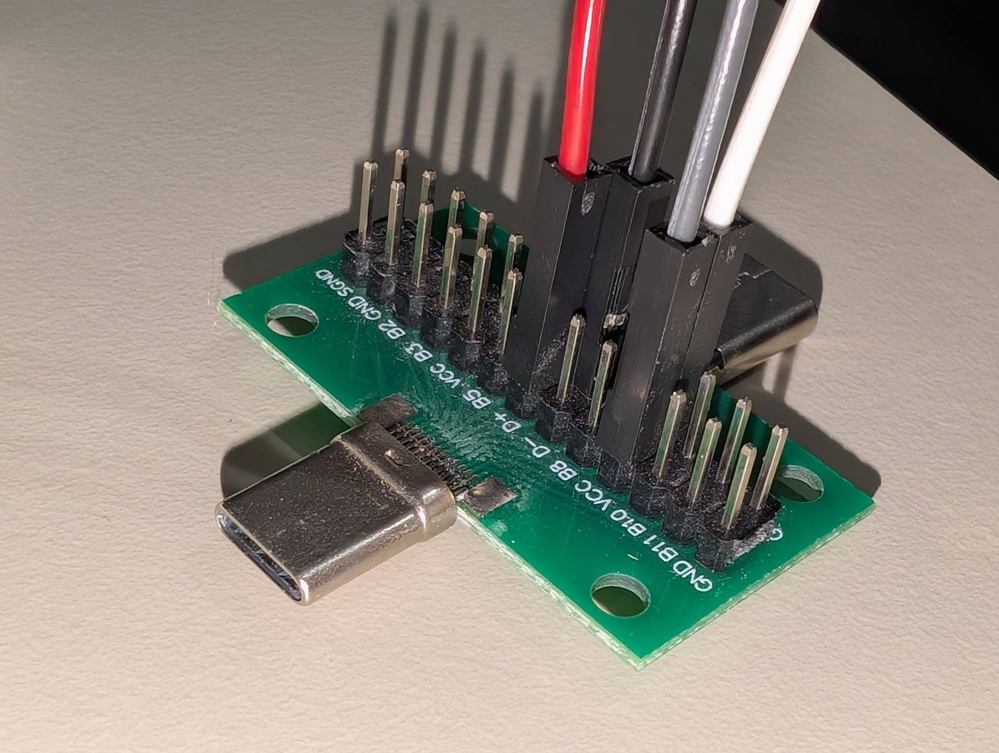

# KeypadFlasher

This project contains custom firmware compatible with a number of different CH55x based programmable keypads found on sites like Aliexpress and Amazon.

## TODO

This project is work in progress, what's left to do:
- Handle / fix passive disconnections from CH55x bootloader during inactivity
- Handle special keys in the input box e.g. Enter, Backspace, etc.
- Add media keys to the function list
- Add support for copy/pasting/reordering steps
- Add support for saving/loading configuration to local storage or files
- Add LED configuration and effects
- Add UI options for the bootloader mode chord and bootloader on boot settings
- Build the adapter to easily enter bootloader mode without opening the device up or making the contraption manually
- Probably some other stuff I've forgotten about

## Usage

Don't have a keypad yet? See the [supported devices](#supported-devices) section for some compatible options.

Please see the [development](#development) section for instructions on manually building the project from source.

If you just want to use it, visit https://keypad-flasher.amyjeanes.com for the hosted version of the web app in a WebUSB compatible browser (anything based on Chromium, e.g. Chrome, Edge, Opera)

You will need to ensure the device is plugged in while in bootloader mode to be recognised and flashed by the app.

I am currently building a simple adapter you can plug into the device in between the USB cable and the keypad that will allow you to easily enter bootloader mode without opening the device up. If you would like one of these adapters, please contact me via email (see my GitHub profile). I will update this README when they are available for purchase.

In the mean time, you can enter bootloader mode by creating the following contraption manually, many thanks to [@dzid26](https://github.com/dzid26) for helping out with this:

You will need:
- A USB-C male to female breakout board with headers
  - Some options here, make sure they are male to female:
    - https://www.aliexpress.com/item/1005009136277062.html
    - https://www.amazon.co.uk/Nicear-Type-C-Double-Sided-Connector-Transfer/dp/B0F1Y43GY3
    - https://www.ebay.co.uk/itm/194958873406?var=495399427358
- 4 male to female jumper wires
- 2 10k ohm resistors
- A breadboard

Wiring guide:
- Consider the 2 10k ohm resistors as R1 and R2
- Consider the 4 jumpers as J1, J2, J3 and J4 and JXM as the male end and JXF as the female end of each jumper (e.g. J1F is female, J1M is male)
- Plug the USB-C breakout board into the keypad's USB-C female port
- **Do not** plug in the USB cable into your computer yet
- Connect J1M and J2M to opposite sides of a breadboard row
- Connect one end of R1 next to J1M and the other end next to J2M
- Repeat this with J3M, J4M and R2 on another breadboard row
- Connect J1F to the VCC pin on one side of the USB-C breakout board
- Connect J2F to the D+ pin on the same side of the USB-C breakout board
- Repeat this on the other side of the USB-C breakout board with J3F and J4F
  - This is needed due to the reversible nature of USB-C connectors

It should end up look something like this:




Essentially, we are shorting D+ to VCC on both sides of the USB-C breakout board using 10k ohm resistors when the device is powered on, which forces it into bootloader mode.

You could also make a version of this with a USB-A 2.0+ breakout board too which you could use with a USB-A to USB-C cable if you have one of those instead.

To verify whether your device is in HID (default) mode or bootloader mode on Windows, you can run in PowerShell the following snippet:

```powershell
$devices = (Get-CimInstance -ClassName CIM_LogicalDevice).DeviceID; if(($devices | ? { $_.Contains("VID_1209&PID_C55D") })) { "HID mode" } elseif (($devices | ? { $_.Contains("VID_4348&PID_55E0")})) { "bootloader mode" } else { "device not found" }
```

On Linux, you can use `lsusb` and look for either of these IDs:
- HID mode: `1209:C55D`
- Bootloader mode: `4348:55E0`

Once the device is in bootloader mode, we can connect to it using the web app on Windows / Mac / Linux / Android, except if you're on Windows devices which need one more step.

On Windows, you will need to install a driver for the CH55x bootloader to be recognised. You can use [Zadig](https://zadig.akeo.ie/) to install the "WinUSB" driver for the device (will likely show up as Unknown Device #1) when in bootloader mode.

Please note that the CH55x bootloader on some devices has a quirk where it will only stay in bootloader mode for about 10 seconds after being plugged in, so you may need to be quick to connect to it in the web app. Once connected you get a few minutes to actually flash the firmware, but that will eventually time out as well. It may also still show as being in bootloader mode from a USB perspective even after timing out, so if you cannot connect, unplug and replug the device to re-enter bootloader mode.

Now you can hopefully connect to the device in the app and flash the new firmware! If you cannot see any devices in the connection window, please ensure that the device is connected in bootloader mode and that you have the correct drivers installed (on Windows).

At this time there is only very basic firmware that is designed for keypads with 1 knob and 3 buttons but this will be updated soon to handle different layouts and actually allow remapping of keys etc. The current firmware will just register the 3 buttons as Ctrl-C, Ctrl-V and Ctrl-Z and the knob as scroll up/down.

Please note that the original firmware on the device will be lost when you flash this custom firmware, so only proceed if you are okay with that.

## Supported devices

The following is a list of tested and known compatible devices, but other devices using the CH55x series microcontrollers may also work.


They all have USB-C connectors unless otherwise noted:

- [2 Keys](https://www.aliexpress.com/item/1005004970126333.html?spm=a2g0o.order_detail.order_detail_item.3.3c7af19cNrdJJB)
  - Uses non-standard LEDs that are not compatible with this project's NeoPixel support so LED functionality will not work
- [3 Keys 1 Knob](https://www.aliexpress.com/item/1005006627901462.html?spm=a2g0o.order_detail.order_detail_item.3.295bf19c3IDC8m)
- [4 Keys](https://www.aliexpress.com/item/1005008020501723.html?spm=a2g0o.order_detail.order_detail_item.3.7d51f19cZTzoOY)
- [6 Keys 1 Knob](https://www.aliexpress.com/item/1005009812219099.html?spm=a2g0o.order_detail.order_detail_item.3.6afff19cXlayc4)
- [10 Keys](https://www.aliexpress.com/item/1005005509140217.html?spm=a2g0o.order_detail.order_detail_item.7.3c7af19cNrdJJB)
  - Uses a Micro-USB connector, will need a Micro-USB to USB-C adapter and USB-C cable to use the bootloader adapter / contraption above
  - Uses fixed blue LEDs that are always on and cannot be controlled by the firmware

## Unsupported devices

These devices have been tested and found to use different types of microcontrollers, and are not compatible with this firmware:

- [9 Keys](https://www.aliexpress.com/item/1005005307250747.html?spm=a2g0o.order_detail.order_detail_item.5.3c7af19cNrdJJB)
  - Uses a CH32V203 microcontroller
  - Can remap keys using https://sayodevice.com/ web-based flasher (similar to this project!)
- [12 Keys 2 Knobs](https://www.aliexpress.com/item/1005007160113318.html?spm=a2g0o.order_detail.order_detail_item.3.5bd6f19cdqcQwn)
  - Uses a CH579M microcontroller
  - Can remap keys using https://github.com/kriomant/ch57x-keyboard-tool or other CH57x programming tools

## Adding support for new keypads

- Connect the keypad in bootloader mode with the web app. Turn on Development mode to see the bootloader ID in the detected device card (e.g. `Bootloader 2.31 · ID 126, 80, 44, 189`). Copy those four numbers.
- Turn on **Debug firmware (USB CDC)** in the app and click **Compile & Flash**. Debug firmware works without a known config and exposes a USB serial port; it prints a banner, per-pin snapshots, and a 1s summary so you can see which pins change when you press buttons or rotate the encoder.
- Open a serial terminal to the new USB CDC device (baud rate does not matter) and press buttons/rotate the knob. Notes from the log:
  - Pins are labelled `P<port>.<bit>` (e.g. `P3.2` for pin `32`).
  - `active_low` means the signal reads low when pressed; `active` shows whether the firmware considers the input asserted.
  - Lines marked `configured` came from an existing config; unmarked lines help you find unused pins.
- Add an entry keyed by the bootloader ID to [Keypad.Flasher.Client/src/lib/keypad-configs.ts](Keypad.Flasher.Client/src/lib/keypad-configs.ts). Provide a friendly `name`, fill `buttons` with pin numbers, `activeLow`, optional `ledIndex`, `bootloaderOnBoot`, and `bootloaderChordMember`, add any `encoders`, and set `neoPixelPin` (or `-1` if none). Example:

```ts
"126-80-44-189": {
  name: "3 Keys 1 Knob",
  config: {
    buttons: [
      { pin: 33, activeLow: true, ledIndex: -1, bootloaderOnBoot: true, bootloaderChordMember: false, function: { type: "Sequence", sequence: "enter", delay: 5 } },
    ],
    encoders: [
      { pinA: 31, pinB: 30, clockwise: { type: "Function", functionPointer: "hid_consumer_volume_up" }, counterClockwise: { type: "Function", functionPointer: "hid_consumer_volume_down" } },
    ],
    neoPixelPin: 34,
  },
},
```

- Reflash without the debug checkbox to validate the mapping, then open a PR adding the new config so others can use it.

## Development

To build and run the project from source, you will need:
- Visual Studio Code
- .NET 10 SDK
- Node.js v22+
- Arduino IDE with arduino-cli installed and on the system PATH

First time setup:
```bash
arduino-cli core install CH55xDuino:mcs51
git clone https://github.com/AmyJeanes/KeypadFlasher
cd KeypadFlasher/Keypad.Flasher.Client
npm install
```

Compile device firmware manually:
```bash
cd Keypad.Firmware
arduino-cli compile --fqbn CH55xDuino:mcs51:ch552:usb_settings=user148,clock=16internal --export-binaries
```

You can also configure the Arduino IDE and use that to compile and upload the firmware if you prefer a GUI:
- Open Arduino IDE
- Open the `Keypad.Firmware/Keypad.Firmware.ino` project
- Select the board "CH55xDuino" on Tools > Board
- Select "P3.6 (D+) Pull up" on Tools -> Bootloader
- Select "16MHz Internal 3.5V or 5V" on Tools -> Clock
- Select "USB" on Tools -> Upload method
- Select "USER CODE w/148B USB RAM" on Tools -> USB Settings
- Compile the project
- Connect the device in bootloader mode
- Upload the firmware (note: original firmware will be lost!)

Run the web app locally:
```
dotnet run --project Keypad.Flasher.Server
```

or

Build and run docker image:
```
docker build -t keypad -f .\Keypad.Flasher.Server\Dockerfile .
docker run -p 54196:8080 --rm -it -m 256MB keypad
```

If the browser does not open automatically, open a Chromium-based browser and navigate to `http://localhost:54196`
